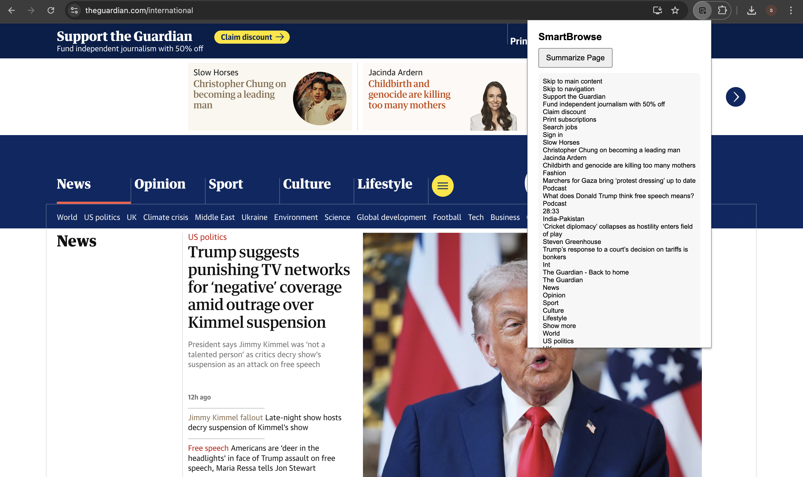

# SmartBrowse   
Chrome Extension for Summarizing Long Articles  

---

##  Features  
- Summarizes long articles, blogs, or research papers in one click  
- Uses **Chrome AI API (`chrome.ai.summarize`)** if available  
- Falls back to a **local extractive summarizer** when API is missing  
- Minimal popup UI with “Summarize Page” button  

---

##  Screenshot  
  
*(Add your own screenshot here — you can take it by pressing `PrtScn` or `Shift+Cmd+4` on Mac and crop the popup)*  

---

##  Built With  
- **JavaScript (ES6+), HTML5, CSS3**  
- **Chrome Extensions (Manifest V3)**  
- **Chrome AI API, Tabs API, Storage API**  
- **Local Storage**  
- **Chrome DevTools**  

---

##  Installation  

1. Clone this repository:  
   ```bash
   git clone https://github.com/your-username/smartbrowse.git

